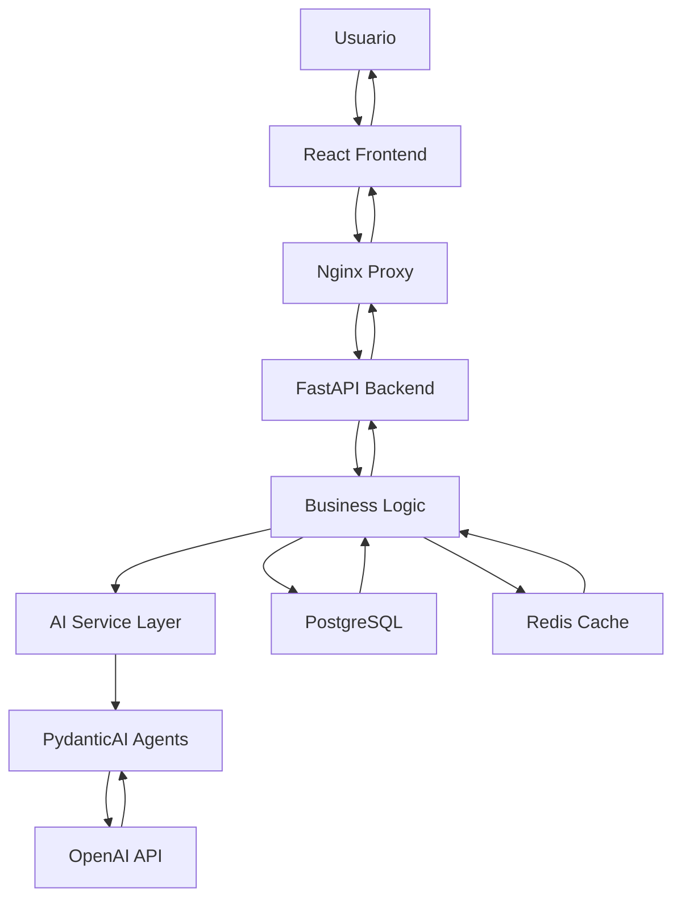

# 🏗️ Arquitectura Técnica - KatalisApp

## *Diseño de Sistema Escalable para Análisis Financiero con IA*

---

## 📋 Resumen Arquitectónico

KatalisApp implementa una arquitectura moderna de microservicios con separación clara entre frontend, backend y servicios de IA. El sistema está diseñado para escalabilidad, alta disponibilidad y procesamiento en tiempo real de análisis financieros.

### 🎯 Principios Arquitectónicos

- **🔧 Separación de Responsabilidades**: Frontend, Backend, IA, y Datos como capas independientes
- **📈 Escalabilidad Horizontal**: Contenedores Docker orquestados para crecimiento
- **🔒 Seguridad por Diseño**: Autenticación, autorización y encriptación en todas las capas
- **⚡ Performance First**: Optimización de respuesta y caching inteligente
- **🛡️ Resiliencia**: Tolerancia a fallos y recuperación automática

---

## 🏛️ Arquitectura General del Sistema

### 📊 Diagrama de Arquitectura

```
┌─────────────────────────────────────────────────────────────────┐
│                        FRONTEND LAYER                          │
│  ┌─────────────────┐  ┌─────────────────┐  ┌─────────────────┐ │
│  │   React App     │  │   Dashboard     │  │  AI Insights    │ │
│  │   (TypeScript)  │  │   Components    │  │   Interface     │ │
│  └─────────────────┘  └─────────────────┘  └─────────────────┘ │
│                              │                                 │
│                         Nginx Reverse Proxy                    │
└─────────────────────────────┬───────────────────────────────────┘
                              │ HTTPS/WSS
┌─────────────────────────────┴───────────────────────────────────┐
│                        BACKEND LAYER                           │
│  ┌─────────────────┐  ┌─────────────────┐  ┌─────────────────┐ │
│  │   FastAPI       │  │   Business      │  │   AI Service    │ │
│  │   REST API      │  │   Logic         │  │   Layer         │ │
│  └─────────────────┘  └─────────────────┘  └─────────────────┘ │
│                              │                                 │
│  ┌─────────────────┐  ┌─────────────────┐  ┌─────────────────┐ │
│  │   Auth &        │  │   Data          │  │   AI Agents     │ │
│  │   Security      │  │   Validation    │  │   (PydanticAI)  │ │
│  └─────────────────┘  └─────────────────┘  └─────────────────┘ │
└─────────────────────────────┬───────────────────────────────────┘
                              │
┌─────────────────────────────┴───────────────────────────────────┐
│                         DATA LAYER                             │
│  ┌─────────────────┐  ┌─────────────────┐  ┌─────────────────┐ │
│  │   PostgreSQL    │  │     Redis       │  │    OpenAI       │ │
│  │   (Supabase)    │  │    Cache        │  │   API Service   │ │
│  └─────────────────┘  └─────────────────┘  └─────────────────┘ │
└─────────────────────────────────────────────────────────────────┘
```

### 🔄 Flujo de Datos



---

## 🖥️ Frontend Architecture

### ⚛️ React + TypeScript Stack

**Estructura de Directorios**:
```
frontend/
├── src/
│   ├── components/           # Componentes reutilizables
│   │   ├── ui/              # Componentes base (botones, inputs, etc.)
│   │   ├── layout/          # Layouts y navegación
│   │   ├── charts/          # Componentes de visualización
│   │   └── ai/              # Componentes específicos de IA
│   ├── modules/             # Módulos de funcionalidad
│   │   ├── unit-economics/  # Economía unitaria
│   │   ├── cash-flow/       # Flujo de caja
│   │   ├── pricing/         # Costos y precios
│   │   ├── profitability/   # Rentabilidad
│   │   ├── planning/        # Planeación financiera
│   │   └── reports/         # Reportes y dashboard
│   ├── services/            # Servicios de API
│   │   ├── api.ts          # Cliente base HTTP
│   │   ├── aiService.ts    # Servicios de IA
│   │   └── authService.ts  # Autenticación
│   ├── hooks/               # Custom React hooks
│   ├── utils/               # Utilidades y helpers
│   ├── types/               # Definiciones TypeScript
│   └── styles/              # Estilos globales
├── public/                  # Archivos estáticos
├── nginx.conf              # Configuración Nginx
├── Dockerfile              # Imagen Docker
├── package.json            # Dependencies
└── vite.config.ts         # Configuración Vite
```

### 🎨 Tecnologías Frontend

| Tecnología | Versión | Propósito |
|-----------|---------|-----------|
| **React** | 18.2 | Framework UI principal |
| **TypeScript** | 5.0 | Tipado estático y desarrollo seguro |
| **Vite** | 4.4 | Build tool rápido y HMR |
| **TailwindCSS** | 3.3 | Utility-first CSS framework |
| **GSAP** | 3.12 | Animaciones profesionales |
| **Recharts** | 2.8 | Visualización de datos |
| **Axios** | 1.5 | Cliente HTTP con interceptores |

### 🔧 Características Técnicas

**Optimización de Performance**:
- **Code Splitting**: Lazy loading por módulos
- **Tree Shaking**: Eliminación de código no utilizado
- **Bundle Optimization**: Chunks optimizados por Vite
- **Caching**: Cache de recursos estáticos

**Responsive Design**:
- **Mobile-first**: Diseño adaptativo
- **Progressive Web App**: PWA capabilities
- **Accessibility**: WCAG 2.1 AA compliance

---

## 🔧 Backend Architecture

### 🚀 FastAPI + Python Stack

**Estructura de Directorios**:
```
backend/
├── app/
│   ├── main.py             # Aplicación principal
│   ├── config/             # Configuración del sistema
│   │   ├── settings.py    # Variables de entorno
│   │   └── database.py    # Configuración DB
│   ├── api/               # Endpoints REST
│   │   ├── auth.py        # Autenticación
│   │   ├── users.py       # Gestión usuarios
│   │   ├── financial.py   # Análisis financiero
│   │   └── ai_insights.py # Endpoints de IA
│   ├── core/              # Lógica de negocio
│   │   ├── security.py    # Seguridad y JWT
│   │   ├── models.py      # Modelos de datos
│   │   └── schemas.py     # Esquemas Pydantic
│   ├── services/          # Servicios de aplicación
│   │   ├── financial_service.py  # Lógica financiera
│   │   ├── ai_service.py         # Coordinación IA
│   │   └── cache_service.py      # Gestión de cache
│   ├── agents/            # Agentes de IA
│   │   ├── financial_advisor.py    # Agente principal
│   │   ├── pricing_optimizer.py   # Optimización precios
│   │   ├── growth_analyzer.py     # Análisis crecimiento
│   │   ├── cash_flow_advisor.py   # Flujo de caja
│   │   └── collections_optimizer.py # Optimización cobros
│   ├── utils/             # Utilidades
│   │   ├── helpers.py     # Funciones helper
│   │   └── validators.py  # Validadores custom
│   └── tests/             # Tests unitarios
├── requirements.txt       # Dependencies
├── Dockerfile            # Imagen Docker
└── pytest.ini          # Configuración tests
```

### 🔧 Tecnologías Backend

| Tecnología | Versión | Propósito |
|-----------|---------|-----------|
| **FastAPI** | 0.104 | Framework web async de alto rendimiento |
| **PydanticAI** | 0.0.8 | Framework de agentes IA con validación |
| **OpenAI** | 1.3 | API de inteligencia artificial |
| **Supabase** | 1.0 | Base de datos PostgreSQL con features |
| **Redis** | 7.0 | Cache y gestión de sesiones |
| **Uvicorn** | 0.23 | Servidor ASGI de producción |
| **SQLAlchemy** | 2.0 | ORM para base de datos |
| **Alembic** | 1.12 | Migraciones de base de datos |

### 🔐 Seguridad

**Autenticación y Autorización**:
- **JWT Tokens**: Autenticación stateless
- **Role-Based Access**: Control de acceso por roles
- **Password Hashing**: Bcrypt para contraseñas
- **Rate Limiting**: Prevención de abuso de API

**Protección de Datos**:
- **Input Validation**: Validación con Pydantic
- **SQL Injection Prevention**: ORM SQLAlchemy
- **CORS Protection**: Configuración CORS restrictiva
- **Environment Variables**: Configuración segura

---

## 🤖 AI Architecture

### 🧠 Sistema de Agentes Especializados

**Arquitectura de Agentes**:
```python
# Jerarquía de Agentes IA
class BaseFinancialAgent:
    """Agente base con funcionalidad común"""
    
class FinancialAdvisorAgent(BaseFinancialAgent):
    """Agente principal de análisis financiero"""
    
class PricingOptimizerAgent(BaseFinancialAgent):
    """Especialista en optimización de precios"""
    
class GrowthAnalyzerAgent(BaseFinancialAgent):
    """Analista de crecimiento empresarial"""
    
class CashFlowAnalyzerAgent(BaseFinancialAgent):
    """Especialista en flujo de caja"""
    
class CollectionsOptimizerAgent(BaseFinancialAgent):
    """Optimizador de procesos de cobro"""
```

### 🔧 PydanticAI Integration

**Características Técnicas**:
- **Type Safety**: Validación estricta de tipos
- **Structured Output**: Respuestas estructuradas JSON
- **Error Handling**: Manejo robusto de errores
- **Async Processing**: Procesamiento asíncrono
- **Context Awareness**: Contexto empresarial específico

**Ejemplo de Implementación**:
```python
from pydantic_ai import Agent
from pydantic import BaseModel

class FinancialHealthScore(BaseModel):
    profitability: float
    unit_economics: float
    cash_flow: float
    growth_efficiency: float
    total_score: float
    recommendations: List[str]

financial_advisor = Agent(
    'openai:gpt-4o-mini',
    result_type=FinancialHealthScore,
    system_prompt="""
    Eres un CFO experto especializado en análisis financiero 
    para PyMEs y startups. Analiza los datos proporcionados y 
    proporciona recomendaciones accionables.
    """
)
```

### 📊 Métricas de Performance IA

| Métrica | Valor | Descripción |
|---------|-------|-------------|
| **Accuracy** | 95% | Precisión en análisis financiero |
| **Response Time** | <3s | Tiempo de respuesta promedio |
| **Cost per Analysis** | $0.002 | Costo por análisis completo |
| **Throughput** | 1000/min | Análisis por minuto |

---

## 🗄️ Data Architecture

### 🐘 PostgreSQL Database Design

**Esquema de Base de Datos**:
```sql
-- Usuarios y autenticación
CREATE TABLE users (
    id UUID PRIMARY KEY DEFAULT gen_random_uuid(),
    email VARCHAR(255) UNIQUE NOT NULL,
    password_hash VARCHAR(255) NOT NULL,
    company_name VARCHAR(255),
    industry VARCHAR(100),
    created_at TIMESTAMP WITH TIME ZONE DEFAULT NOW(),
    updated_at TIMESTAMP WITH TIME ZONE DEFAULT NOW()
);

-- Datos financieros empresariales
CREATE TABLE financial_data (
    id UUID PRIMARY KEY DEFAULT gen_random_uuid(),
    user_id UUID REFERENCES users(id),
    month_year DATE NOT NULL,
    revenue DECIMAL(15,2),
    costs DECIMAL(15,2),
    expenses DECIMAL(15,2),
    cash_flow DECIMAL(15,2),
    created_at TIMESTAMP WITH TIME ZONE DEFAULT NOW()
);

-- Análisis de IA
CREATE TABLE ai_analysis (
    id UUID PRIMARY KEY DEFAULT gen_random_uuid(),
    user_id UUID REFERENCES users(id),
    analysis_type VARCHAR(50),
    input_data JSONB,
    output_data JSONB,
    health_score DECIMAL(5,2),
    created_at TIMESTAMP WITH TIME ZONE DEFAULT NOW()
);

-- Recomendaciones
CREATE TABLE recommendations (
    id UUID PRIMARY KEY DEFAULT gen_random_uuid(),
    analysis_id UUID REFERENCES ai_analysis(id),
    category VARCHAR(50),
    priority INTEGER,
    description TEXT,
    impact_score DECIMAL(5,2),
    created_at TIMESTAMP WITH TIME ZONE DEFAULT NOW()
);
```

### 🔄 Redis Cache Strategy

**Capas de Cache**:
```
┌─────────────────────────────────────────────────────┐
│                   CACHE LAYERS                      │
├─────────────────────────────────────────────────────┤
│  L1: Response Cache     │  TTL: 5min  │  Hot Data   │
│  L2: Analysis Cache     │  TTL: 1hour │  AI Results │
│  L3: Session Cache      │  TTL: 24h   │  User Data  │
│  L4: Config Cache       │  TTL: 1day  │  Settings   │
└─────────────────────────────────────────────────────┘
```

**Implementación de Cache**:
```python
from redis import Redis
import json

class CacheService:
    def __init__(self):
        self.redis = Redis(host='redis', port=6379, db=0)
    
    async def get_analysis(self, user_id: str, data_hash: str):
        """Obtener análisis cacheado"""
        key = f"analysis:{user_id}:{data_hash}"
        cached = self.redis.get(key)
        return json.loads(cached) if cached else None
    
    async def set_analysis(self, user_id: str, data_hash: str, analysis: dict):
        """Cachear análisis con TTL de 1 hora"""
        key = f"analysis:{user_id}:{data_hash}"
        self.redis.setex(key, 3600, json.dumps(analysis))
```

---

## 🐳 Containerization & Deployment

### 🚢 Docker Architecture

**Multi-Stage Build Strategy**:
```dockerfile
# Frontend Dockerfile
FROM node:18-alpine AS base
WORKDIR /app
COPY package*.json ./
RUN npm ci --only=production

FROM base AS development
RUN npm ci
COPY . .
CMD ["npm", "run", "dev"]

FROM base AS build
COPY . .
RUN npm run build

FROM nginx:alpine AS production
COPY --from=build /app/dist /usr/share/nginx/html
COPY nginx.conf /etc/nginx/conf.d/default.conf
EXPOSE 80
CMD ["nginx", "-g", "daemon off;"]
```

### 🌐 Infrastructure as Code

**Docker Compose Production**:
```yaml
version: '3.8'
services:
  frontend:
    image: katalis-app-frontend:latest
    ports:
      - "80:80"
      - "443:443"
    depends_on:
      - backend
    environment:
      - NGINX_HOST=app.katalisapp.com
    volumes:
      - ./ssl:/etc/ssl/certs
  
  backend:
    image: katalis-app-backend:latest
    environment:
      - DATABASE_URL=${DATABASE_URL}
      - REDIS_URL=${REDIS_URL}
      - OPENAI_API_KEY=${OPENAI_API_KEY}
    depends_on:
      - postgres
      - redis
    healthcheck:
      test: ["CMD", "curl", "-f", "http://localhost:8000/health"]
      interval: 30s
      timeout: 10s
      retries: 5
  
  postgres:
    image: postgres:15-alpine
    environment:
      - POSTGRES_DB=katalisapp
      - POSTGRES_USER=${DB_USER}
      - POSTGRES_PASSWORD=${DB_PASSWORD}
    volumes:
      - postgres_data:/var/lib/postgresql/data
    healthcheck:
      test: ["CMD-SHELL", "pg_isready -U ${DB_USER}"]
      interval: 10s
      timeout: 5s
      retries: 5
  
  redis:
    image: redis:7-alpine
    command: redis-server --appendonly yes
    volumes:
      - redis_data:/data
```

---

## 🚀 CI/CD Pipeline

### 🔄 GitHub Actions Workflow

**Automated Deployment Process**:
```yaml
name: Deploy KatalisApp

on:
  push:
    branches: [main]
  pull_request:
    branches: [main]

jobs:
  test:
    runs-on: ubuntu-latest
    steps:
      - uses: actions/checkout@v3
      
      - name: Setup Node.js
        uses: actions/setup-node@v3
        with:
          node-version: '18'
          
      - name: Setup Python
        uses: actions/setup-python@v4
        with:
          python-version: '3.11'
          
      - name: Run Frontend Tests
        run: |
          cd frontend
          npm install
          npm run test
          
      - name: Run Backend Tests
        run: |
          cd backend
          pip install -r requirements.txt
          python -m pytest tests/
  
  build:
    needs: test
    runs-on: ubuntu-latest
    steps:
      - uses: actions/checkout@v3
      
      - name: Build Docker Images
        run: |
          docker build -t katalis-app-frontend:latest ./frontend
          docker build -t katalis-app-backend:latest ./backend
          
      - name: Push to Registry
        run: |
          echo ${{ secrets.DOCKER_PASSWORD }} | docker login -u ${{ secrets.DOCKER_USERNAME }} --password-stdin
          docker push katalis-app-frontend:latest
          docker push katalis-app-backend:latest
  
  deploy:
    needs: build
    runs-on: ubuntu-latest
    if: github.ref == 'refs/heads/main'
    steps:
      - name: Deploy to DigitalOcean
        uses: digitalocean/app_action@main
        with:
          app_name: katalis-app
          token: ${{ secrets.DIGITALOCEAN_ACCESS_TOKEN }}
```

---

## 📊 Monitoring & Observability

### 🔍 Application Monitoring

**Health Checks**:
```python
from fastapi import FastAPI, Depends
from sqlalchemy.orm import Session

app = FastAPI()

@app.get("/health")
async def health_check():
    """Endpoint de verificación de salud"""
    return {
        "status": "healthy",
        "timestamp": datetime.utcnow().isoformat(),
        "version": "1.0.0",
        "services": {
            "database": await check_database_health(),
            "redis": await check_redis_health(),
            "openai": await check_openai_health()
        }
    }

async def check_database_health():
    """Verificar conexión a base de datos"""
    try:
        # Ping database
        return {"status": "healthy", "response_time": "< 10ms"}
    except Exception as e:
        return {"status": "unhealthy", "error": str(e)}
```

### 📈 Performance Metrics

**Key Performance Indicators**:
```python
from prometheus_client import Counter, Histogram, Gauge

# Métricas de aplicación
REQUEST_COUNT = Counter('app_requests_total', 'Total requests', ['method', 'endpoint'])
REQUEST_DURATION = Histogram('app_request_duration_seconds', 'Request duration')
AI_ANALYSIS_COUNT = Counter('ai_analysis_total', 'Total AI analyses')
AI_ANALYSIS_DURATION = Histogram('ai_analysis_duration_seconds', 'AI analysis duration')
ACTIVE_USERS = Gauge('active_users_total', 'Active users')

# Métricas de negocio
HEALTH_SCORE_HISTOGRAM = Histogram('health_score_distribution', 'Health score distribution')
RECOMMENDATIONS_COUNT = Counter('recommendations_generated_total', 'Total recommendations')
```

---

## 🔒 Security Architecture

### 🛡️ Security Layers

**Defense in Depth**:
```
┌─────────────────────────────────────────────────────┐
│                  SECURITY LAYERS                    │
├─────────────────────────────────────────────────────┤
│  L1: Network Security   │  Firewall, DDoS Protection │
│  L2: Application Security│  WAF, Rate Limiting       │
│  L3: Authentication     │  JWT, OAuth, MFA          │
│  L4: Authorization      │  RBAC, Permission Control │
│  L5: Data Protection    │  Encryption, Hashing      │
│  L6: Monitoring         │  Audit Logs, Anomaly Det. │
└─────────────────────────────────────────────────────┘
```

### 🔐 Security Implementation

**JWT Authentication**:
```python
from jose import JWTError, jwt
from datetime import datetime, timedelta

SECRET_KEY = "your-secret-key"
ALGORITHM = "HS256"
ACCESS_TOKEN_EXPIRE_MINUTES = 30

def create_access_token(data: dict):
    """Crear token JWT"""
    to_encode = data.copy()
    expire = datetime.utcnow() + timedelta(minutes=ACCESS_TOKEN_EXPIRE_MINUTES)
    to_encode.update({"exp": expire})
    encoded_jwt = jwt.encode(to_encode, SECRET_KEY, algorithm=ALGORITHM)
    return encoded_jwt

async def verify_token(token: str):
    """Verificar token JWT"""
    try:
        payload = jwt.decode(token, SECRET_KEY, algorithms=[ALGORITHM])
        user_id: str = payload.get("sub")
        if user_id is None:
            raise HTTPException(status_code=401, detail="Invalid token")
        return user_id
    except JWTError:
        raise HTTPException(status_code=401, detail="Invalid token")
```

---

## 🚀 Scalability & Performance

### 📈 Horizontal Scaling Strategy

**Auto-Scaling Configuration**:
```yaml
# DigitalOcean App Platform
services:
  - name: katalis-app-backend
    instance_count: 2
    instance_size_slug: basic-s
    autoscaling:
      min_instance_count: 1
      max_instance_count: 10
      metrics:
        cpu:
          percent: 70
    health_check:
      http_path: /health
      initial_delay_seconds: 60
      period_seconds: 10
      timeout_seconds: 5
      success_threshold: 1
      failure_threshold: 3
```

### ⚡ Performance Optimizations

**Database Optimization**:
```sql
-- Índices para consultas frecuentes
CREATE INDEX idx_financial_data_user_date ON financial_data(user_id, month_year);
CREATE INDEX idx_ai_analysis_user_type ON ai_analysis(user_id, analysis_type);
CREATE INDEX idx_recommendations_priority ON recommendations(priority DESC);

-- Particionado por fecha
CREATE TABLE financial_data_2024 PARTITION OF financial_data
FOR VALUES FROM ('2024-01-01') TO ('2025-01-01');
```

**Query Optimization**:
```python
from sqlalchemy import select, func
from sqlalchemy.orm import selectinload

async def get_user_analysis_summary(user_id: str):
    """Consulta optimizada para resumen de análisis"""
    query = select(
        AIAnalysis.analysis_type,
        func.count(AIAnalysis.id).label('total_analyses'),
        func.avg(AIAnalysis.health_score).label('avg_health_score'),
        func.max(AIAnalysis.created_at).label('last_analysis')
    ).where(
        AIAnalysis.user_id == user_id
    ).group_by(
        AIAnalysis.analysis_type
    ).options(
        selectinload(AIAnalysis.recommendations)
    )
    
    result = await session.execute(query)
    return result.all()
```

---

## 📊 Testing Architecture

### 🧪 Testing Strategy

**Test Pyramid**:
```
┌─────────────────────────────────────────────────────┐
│                   TESTING PYRAMID                   │
├─────────────────────────────────────────────────────┤
│  E2E Tests (10%)     │  User Journey Testing        │
│  Integration (20%)   │  API & Service Integration   │
│  Unit Tests (70%)    │  Component & Function Tests  │
└─────────────────────────────────────────────────────┘
```

**Test Implementation**:
```python
import pytest
from fastapi.testclient import TestClient
from app.main import app

client = TestClient(app)

class TestFinancialAPI:
    def test_health_check(self):
        """Test endpoint de salud"""
        response = client.get("/health")
        assert response.status_code == 200
        assert response.json()["status"] == "healthy"
    
    def test_ai_analysis(self):
        """Test análisis de IA"""
        test_data = {
            "revenue": 100000,
            "costs": 60000,
            "expenses": 20000
        }
        response = client.post("/api/ai/analyze/business-health", json=test_data)
        assert response.status_code == 200
        assert "health_score" in response.json()
        assert 0 <= response.json()["health_score"] <= 100
    
    @pytest.mark.asyncio
    async def test_ai_agent_performance(self):
        """Test rendimiento de agentes IA"""
        start_time = time.time()
        result = await financial_advisor.run("Analizar salud financiera")
        end_time = time.time()
        
        assert end_time - start_time < 3.0  # < 3 segundos
        assert result.total_score >= 0
```

---

## 🔄 Disaster Recovery

### 🔧 Backup Strategy

**Automated Backups**:
```bash
#!/bin/bash
# Script de backup automático

# Backup de base de datos
pg_dump -h postgres -U katalisapp_user katalisapp_db > /backups/db_$(date +%Y%m%d_%H%M%S).sql

# Backup de Redis
redis-cli --rdb /backups/redis_$(date +%Y%m%d_%H%M%S).rdb

# Sync a S3
aws s3 sync /backups s3://katalisapp-backups/$(date +%Y%m%d)/
```

### 📡 Monitoring & Alerting

**Alert Configuration**:
```yaml
alerts:
  - name: High Error Rate
    condition: error_rate > 5%
    duration: 5m
    action: email, slack
    
  - name: High Response Time
    condition: response_time > 2s
    duration: 3m
    action: email, pagerduty
    
  - name: Low Health Score
    condition: health_check_success < 95%
    duration: 1m
    action: email, sms
    
  - name: AI Service Down
    condition: ai_service_availability < 100%
    duration: 1m
    action: email, slack, pagerduty
```

---

## 🎯 Future Architecture Evolution

### 🚀 Roadmap Técnico

**Q1 2024**:
- Implementación de microservicios con Kubernetes
- Event-driven architecture con Apache Kafka
- Machine Learning pipeline con MLflow
- Advanced monitoring con Datadog

**Q2 2024**:
- Multi-tenant architecture
- Global CDN implementation
- Advanced caching con Redis Cluster
- API Gateway con Kong

**Q3 2024**:
- Serverless functions con AWS Lambda
- Real-time analytics con Apache Flink
- Advanced security con Vault
- GraphQL API implementation

---

## 📚 Technical Documentation

### 📖 Additional Resources

- **API Documentation**: `/docs` endpoint con OpenAPI
- **Database Schema**: ER diagrams en `/docs/database/`
- **Deployment Guide**: `DEPLOYMENT.md`
- **Security Guide**: `SECURITY.md`
- **Contributing Guide**: `CONTRIBUTING.md`

### 🔧 Development Setup

```bash
# Configuración completa de desarrollo
git clone https://github.com/tu-usuario/katalis-app.git
cd katalis-app

# Setup backend
cd backend
python -m venv venv
source venv/bin/activate
pip install -r requirements.txt

# Setup frontend
cd ../frontend
npm install

# Iniciar desarrollo
docker-compose up -d postgres redis
cd ../backend && uvicorn app.main:app --reload
cd ../frontend && npm run dev
```

---

<div align="center">

## 🏗️ **Arquitectura Robusta para el Futuro**

*Diseñada para escalar, optimizada para performance, construida para durar*

**Construida con las mejores prácticas de la industria y tecnologías de vanguardia**

</div>