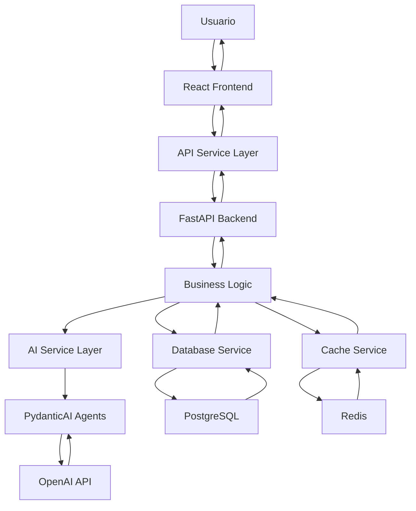

# 👨‍💻 Guía para Desarrolladores - KatalisApp

## *Manual Completo de Desarrollo y Contribución*

---

## 📋 Tabla de Contenidos

1. [Introducción](#-introducción)
2. [Configuración del Entorno](#-configuración-del-entorno)
3. [Arquitectura del Proyecto](#-arquitectura-del-proyecto)
4. [Estándares de Desarrollo](#-estándares-de-desarrollo)
5. [Flujo de Trabajo](#-flujo-de-trabajo)
6. [Testing](#-testing)
7. [Deployment](#-deployment)
8. [Contribución](#-contribución)
9. [Troubleshooting](#-troubleshooting)
10. [Recursos](#-recursos)

---

## 🚀 Introducción

**KatalisApp** es una plataforma SaaS de análisis financiero empresarial que utiliza IA para proporcionar insights accionables a PyMEs y emprendedores. Este documento es tu guía completa para desarrollar, contribuir y mantener el proyecto.

### 🎯 Stack Tecnológico

**Frontend**:
- React 18.2 + TypeScript 5.0
- Vite 4.4 (Build tool)
- TailwindCSS 3.3 (Styling)
- GSAP 3.12 (Animations)
- Recharts 2.8 (Data visualization)

**Backend**:
- FastAPI 0.104 (API framework)
- Python 3.11
- PydanticAI 0.0.8 (AI agents)
- OpenAI GPT-4o-mini (AI model)
- PostgreSQL + Supabase (Database)
- Redis (Cache)

**Infrastructure**:
- Docker + Docker Compose
- Nginx (Reverse proxy)
- GitHub Actions (CI/CD)
- DigitalOcean (Hosting)

---

## 🛠️ Configuración del Entorno

### 📋 Prerrequisitos

```bash
# Versiones requeridas
node --version    # >= 18.0.0
npm --version     # >= 9.0.0
python --version  # >= 3.11.0
docker --version  # >= 20.0.0
git --version     # >= 2.30.0
```

### 🔧 Instalación Inicial

#### 1. Clonar el Repositorio

```bash
git clone https://github.com/tu-usuario/katalis-app.git
cd katalis-app
```

#### 2. Configurar Variables de Entorno

```bash
# Crear archivo .env en la raíz del proyecto
cp .env.example .env

# Editar variables necesarias
nano .env
```

**Variables Críticas**:
```env
# OpenAI (obligatorio para IA)
OPENAI_API_KEY=sk-your-openai-api-key-here

# Supabase (obligatorio para DB)
SUPABASE_URL=https://your-project.supabase.co
SUPABASE_ANON_KEY=your-anon-key
SUPABASE_SERVICE_KEY=your-service-key

# Security
SECRET_KEY=your-secret-key-here
JWT_SECRET_KEY=your-jwt-secret-here

# Redis
REDIS_URL=redis://localhost:6379/0
```

#### 3. Configurar Backend

```bash
cd backend

# Crear entorno virtual
python -m venv venv

# Activar entorno (Linux/Mac)
source venv/bin/activate

# Activar entorno (Windows)
venv\Scripts\activate

# Instalar dependencias
pip install -r requirements.txt

# Verificar instalación
python -c "import fastapi; print('FastAPI instalado correctamente')"
python -c "import pydantic_ai; print('PydanticAI instalado correctamente')"
```

#### 4. Configurar Frontend

```bash
cd frontend

# Instalar dependencias
npm install

# Verificar instalación
npm run type-check
```

#### 5. Configurar Base de Datos

```bash
# Iniciar servicios con Docker
docker-compose up -d postgres redis

# Verificar conexión
docker-compose logs postgres
docker-compose logs redis
```

### 🚀 Iniciar Desarrollo

```bash
# Terminal 1: Backend
cd backend
source venv/bin/activate
uvicorn app.main:app --reload --port 8000

# Terminal 2: Frontend
cd frontend
npm run dev

# Terminal 3: Servicios adicionales
docker-compose up -d postgres redis
```

**URLs de Desarrollo**:
- Frontend: http://localhost:3000
- Backend API: http://localhost:8000
- API Docs: http://localhost:8000/docs
- Database: localhost:5432
- Redis: localhost:6379

---

## 🏗️ Arquitectura del Proyecto

### 📁 Estructura de Directorios

```
katalis-app/
├── 📁 frontend/                    # Aplicación React
│   ├── 📁 src/
│   │   ├── 📁 components/         # Componentes reutilizables
│   │   │   ├── 📁 ui/            # Componentes base
│   │   │   ├── 📁 layout/        # Layouts y navegación
│   │   │   ├── 📁 charts/        # Componentes de gráficos
│   │   │   └── 📁 ai/            # Componentes de IA
│   │   ├── 📁 modules/           # Módulos de funcionalidad
│   │   │   ├── 📁 unit-economics/
│   │   │   ├── 📁 cash-flow/
│   │   │   ├── 📁 pricing/
│   │   │   ├── 📁 profitability/
│   │   │   ├── 📁 planning/
│   │   │   └── 📁 reports/
│   │   ├── 📁 services/          # Servicios API
│   │   ├── 📁 hooks/             # Custom hooks
│   │   ├── 📁 utils/             # Utilidades
│   │   ├── 📁 types/             # Tipos TypeScript
│   │   └── 📁 styles/            # Estilos globales
│   ├── 📁 public/                # Archivos estáticos
│   ├── 📄 package.json
│   ├── 📄 vite.config.ts
│   ├── 📄 tailwind.config.js
│   └── 📄 Dockerfile
├── 📁 backend/                     # API FastAPI
│   ├── 📁 app/
│   │   ├── 📄 main.py            # Aplicación principal
│   │   ├── 📁 config/            # Configuración
│   │   ├── 📁 api/               # Endpoints REST
│   │   ├── 📁 core/              # Lógica central
│   │   ├── 📁 services/          # Servicios de aplicación
│   │   ├── 📁 agents/            # Agentes de IA
│   │   ├── 📁 models/            # Modelos de datos
│   │   ├── 📁 schemas/           # Esquemas Pydantic
│   │   ├── 📁 utils/             # Utilidades
│   │   └── 📁 tests/             # Tests unitarios
│   ├── 📄 requirements.txt
│   ├── 📄 pytest.ini
│   └── 📄 Dockerfile
├── 📁 docs/                       # Documentación
├── 📁 .github/workflows/          # GitHub Actions
├── 📄 docker-compose.yml         # Desarrollo
├── 📄 docker-compose.prod.yml    # Producción
├── 📄 deploy.sh                  # Script de deployment
└── 📄 README.md                  # Documentación principal
```

### 🔄 Flujo de Datos



---

## 📏 Estándares de Desarrollo

### 🎨 Convenciones de Código

#### Frontend (TypeScript/React)

```typescript
// ✅ Nombres de archivos: PascalCase para componentes
// UserProfile.tsx, AIInsights.tsx

// ✅ Nombres de variables: camelCase
const userName = 'john_doe';
const userProfile = getUserProfile();

// ✅ Nombres de constantes: UPPER_SNAKE_CASE
const API_BASE_URL = 'http://localhost:8000';
const MAX_RETRY_ATTEMPTS = 3;

// ✅ Interfaces: PascalCase con prefijo 'I' opcional
interface UserProfile {
  id: string;
  name: string;
  email: string;
}

// ✅ Tipos: PascalCase
type AnalysisType = 'business_health' | 'growth_analysis';

// ✅ Componentes: Arrow functions con props tipadas
interface UserCardProps {
  user: UserProfile;
  onEdit: (id: string) => void;
}

const UserCard: React.FC<UserCardProps> = ({ user, onEdit }) => {
  const handleEdit = () => {
    onEdit(user.id);
  };

  return (
    <div className="bg-white p-4 rounded-lg shadow">
      <h3 className="text-lg font-semibold">{user.name}</h3>
      <p className="text-gray-600">{user.email}</p>
      <button 
        onClick={handleEdit}
        className="mt-2 bg-blue-500 text-white px-4 py-2 rounded hover:bg-blue-600"
      >
        Editar
      </button>
    </div>
  );
};
```

#### Backend (Python/FastAPI)

```python
# ✅ Nombres de archivos: snake_case
# user_service.py, ai_insights.py

# ✅ Nombres de variables y funciones: snake_case
user_name = "john_doe"
user_profile = get_user_profile()

# ✅ Nombres de constantes: UPPER_SNAKE_CASE
API_VERSION = "v1"
MAX_RETRY_ATTEMPTS = 3

# ✅ Nombres de clases: PascalCase
class UserService:
    def __init__(self):
        self.db = get_database()
    
    def get_user_profile(self, user_id: str) -> UserProfile:
        """Obtener perfil de usuario por ID"""
        return self.db.get_user(user_id)

# ✅ Pydantic models: PascalCase
class UserProfile(BaseModel):
    id: str
    name: str
    email: str
    created_at: datetime

# ✅ Endpoints: snake_case con prefijo de versión
@app.get("/api/v1/users/{user_id}")
async def get_user_profile(user_id: str) -> UserProfile:
    """Obtener perfil de usuario"""
    user_service = UserService()
    return user_service.get_user_profile(user_id)

# ✅ Docstrings: Formato Google
def calculate_financial_health(revenue: float, expenses: float) -> float:
    """
    Calcular la salud financiera basada en ingresos y gastos.
    
    Args:
        revenue: Ingresos mensuales
        expenses: Gastos mensuales
        
    Returns:
        Score de salud financiera (0-100)
        
    Raises:
        ValueError: Si los valores son negativos
    """
    if revenue < 0 or expenses < 0:
        raise ValueError("Los valores no pueden ser negativos")
    
    return min(100, (revenue - expenses) / revenue * 100)
```

### 🔒 Seguridad

#### Frontend

```typescript
// ✅ Validación de entrada
const validateInput = (input: string): boolean => {
  // Sanitizar entrada
  const sanitized = input.trim().replace(/[<>]/g, '');
  return sanitized.length > 0 && sanitized.length <= 255;
};

// ✅ Manejo de tokens
const getAuthToken = (): string | null => {
  return localStorage.getItem('auth_token');
};

const setAuthToken = (token: string): void => {
  localStorage.setItem('auth_token', token);
};

// ✅ Interceptores de API
axios.interceptors.request.use(
  (config) => {
    const token = getAuthToken();
    if (token) {
      config.headers.Authorization = `Bearer ${token}`;
    }
    return config;
  },
  (error) => Promise.reject(error)
);
```

#### Backend

```python
from fastapi import HTTPException, Depends
from fastapi.security import HTTPBearer
from jose import JWTError, jwt

security = HTTPBearer()

def verify_token(token: str = Depends(security)):
    """Verificar token JWT"""
    try:
        payload = jwt.decode(token.credentials, SECRET_KEY, algorithms=[ALGORITHM])
        user_id: str = payload.get("sub")
        if user_id is None:
            raise HTTPException(status_code=401, detail="Token inválido")
        return user_id
    except JWTError:
        raise HTTPException(status_code=401, detail="Token inválido")

# ✅ Validación de entrada
class UserInput(BaseModel):
    name: str = Field(..., min_length=1, max_length=100)
    email: str = Field(..., regex=r'^[^@]+@[^@]+\.[^@]+$')
    
    @validator('name')
    def validate_name(cls, v):
        if not v.strip():
            raise ValueError('El nombre no puede estar vacío')
        return v.strip()
```

### 📊 Manejo de Errores

#### Frontend

```typescript
// ✅ Custom hook para manejo de errores
import { useState, useCallback } from 'react';

interface ErrorState {
  message: string;
  code?: string;
  details?: any;
}

export const useError = () => {
  const [error, setError] = useState<ErrorState | null>(null);
  const [isLoading, setIsLoading] = useState(false);

  const handleError = useCallback((error: any) => {
    if (error.response?.data?.message) {
      setError({
        message: error.response.data.message,
        code: error.response.status,
        details: error.response.data
      });
    } else {
      setError({
        message: 'Ha ocurrido un error inesperado',
        code: 'UNKNOWN_ERROR'
      });
    }
  }, []);

  const clearError = useCallback(() => {
    setError(null);
  }, []);

  return { error, isLoading, setIsLoading, handleError, clearError };
};

// ✅ Componente de error
const ErrorBoundary: React.FC<{ children: React.ReactNode }> = ({ children }) => {
  const { error, handleError } = useError();

  if (error) {
    return (
      <div className="bg-red-50 border border-red-200 rounded-lg p-4">
        <h3 className="text-red-800 font-semibold">Error</h3>
        <p className="text-red-600">{error.message}</p>
        {error.code && (
          <p className="text-red-500 text-sm mt-2">Código: {error.code}</p>
        )}
      </div>
    );
  }

  return <>{children}</>;
};
```

#### Backend

```python
from fastapi import HTTPException, Request
from fastapi.responses import JSONResponse
import logging

logger = logging.getLogger(__name__)

class KatalisException(Exception):
    """Excepción base para KatalisApp"""
    def __init__(self, message: str, code: str = "INTERNAL_ERROR"):
        self.message = message
        self.code = code
        super().__init__(self.message)

class ValidationError(KatalisException):
    """Error de validación"""
    def __init__(self, message: str):
        super().__init__(message, "VALIDATION_ERROR")

class AIServiceError(KatalisException):
    """Error del servicio de IA"""
    def __init__(self, message: str):
        super().__init__(message, "AI_SERVICE_ERROR")

@app.exception_handler(KatalisException)
async def katalis_exception_handler(request: Request, exc: KatalisException):
    """Handler para excepciones custom"""
    logger.error(f"KatalisException: {exc.message}")
    return JSONResponse(
        status_code=400,
        content={
            "message": exc.message,
            "code": exc.code,
            "path": request.url.path
        }
    )

@app.exception_handler(500)
async def internal_server_error_handler(request: Request, exc: Exception):
    """Handler para errores internos"""
    logger.error(f"Internal server error: {str(exc)}")
    return JSONResponse(
        status_code=500,
        content={
            "message": "Error interno del servidor",
            "code": "INTERNAL_SERVER_ERROR"
        }
    )
```

---

## 🔄 Flujo de Trabajo

### 🌿 Git Workflow

```bash
# 1. Crear rama para nueva funcionalidad
git checkout -b feature/user-authentication

# 2. Hacer cambios y commits frecuentes
git add .
git commit -m "Add user authentication endpoint"

# 3. Push a origin
git push origin feature/user-authentication

# 4. Crear Pull Request en GitHub
# 5. Code review y merge
# 6. Eliminar rama local
git branch -d feature/user-authentication
```

### 📝 Convenciones de Commit

```bash
# Tipos de commit
feat: nueva funcionalidad
fix: corrección de bug
docs: documentación
style: formato (sin cambios de código)
refactor: refactorización
test: agregar tests
chore: tareas de mantenimiento

# Ejemplos
git commit -m "feat: add AI insights component"
git commit -m "fix: resolve authentication token expiration"
git commit -m "docs: update API documentation"
git commit -m "refactor: optimize database queries"
```

### 🔍 Code Review Checklist

**Reviewer**:
- [ ] El código sigue las convenciones establecidas
- [ ] Incluye tests apropiados
- [ ] La documentación está actualizada
- [ ] No hay vulnerabilidades de seguridad
- [ ] El performance es adecuado
- [ ] Los cambios son retrocompatibles

**Author**:
- [ ] Tests pasan localmente
- [ ] Código liteado (eslint, black)
- [ ] Documentación actualizada
- [ ] PR description es clara
- [ ] Cambios son pequeños y enfocados

---

## 🧪 Testing

### 🎯 Estrategia de Testing

**Pirámide de Testing**:
```
    /\
   /  \    E2E Tests (10%)
  /____\   Integration Tests (20%)
 /      \  Unit Tests (70%)
/________\
```

### Frontend Testing

#### Unit Tests (Jest + React Testing Library)

```typescript
// components/__tests__/UserCard.test.tsx
import { render, screen, fireEvent } from '@testing-library/react';
import { UserCard } from '../UserCard';

describe('UserCard', () => {
  const mockUser = {
    id: '1',
    name: 'John Doe',
    email: 'john@example.com'
  };

  const mockOnEdit = jest.fn();

  beforeEach(() => {
    mockOnEdit.mockClear();
  });

  test('renders user information', () => {
    render(<UserCard user={mockUser} onEdit={mockOnEdit} />);
    
    expect(screen.getByText('John Doe')).toBeInTheDocument();
    expect(screen.getByText('john@example.com')).toBeInTheDocument();
  });

  test('calls onEdit when edit button is clicked', () => {
    render(<UserCard user={mockUser} onEdit={mockOnEdit} />);
    
    const editButton = screen.getByText('Editar');
    fireEvent.click(editButton);
    
    expect(mockOnEdit).toHaveBeenCalledWith('1');
  });
});
```

#### Integration Tests

```typescript
// services/__tests__/apiService.test.ts
import { apiService } from '../apiService';
import { server } from '../../../test/mocks/server';

describe('API Service', () => {
  beforeAll(() => server.listen());
  afterEach(() => server.resetHandlers());
  afterAll(() => server.close());

  test('should fetch user profile', async () => {
    const userProfile = await apiService.getUserProfile('1');
    
    expect(userProfile).toEqual({
      id: '1',
      name: 'John Doe',
      email: 'john@example.com'
    });
  });

  test('should handle API errors', async () => {
    server.use(
      rest.get('/api/v1/users/1', (req, res, ctx) => {
        return res(ctx.status(404), ctx.json({ message: 'User not found' }));
      })
    );

    await expect(apiService.getUserProfile('1')).rejects.toThrow('User not found');
  });
});
```

### Backend Testing

#### Unit Tests (pytest)

```python
# tests/test_user_service.py
import pytest
from unittest.mock import Mock, patch
from app.services.user_service import UserService
from app.models.user import User

class TestUserService:
    @pytest.fixture
    def user_service(self):
        return UserService()
    
    @pytest.fixture
    def mock_user(self):
        return User(
            id="1",
            name="John Doe",
            email="john@example.com"
        )
    
    def test_get_user_profile_success(self, user_service, mock_user):
        # Arrange
        with patch.object(user_service, 'db') as mock_db:
            mock_db.get_user.return_value = mock_user
            
            # Act
            result = user_service.get_user_profile("1")
            
            # Assert
            assert result.id == "1"
            assert result.name == "John Doe"
            mock_db.get_user.assert_called_once_with("1")
    
    def test_get_user_profile_not_found(self, user_service):
        # Arrange
        with patch.object(user_service, 'db') as mock_db:
            mock_db.get_user.return_value = None
            
            # Act & Assert
            with pytest.raises(ValueError, match="User not found"):
                user_service.get_user_profile("1")
```

#### Integration Tests

```python
# tests/test_api_endpoints.py
import pytest
from fastapi.testclient import TestClient
from app.main import app

client = TestClient(app)

class TestUserEndpoints:
    def test_get_user_profile_success(self):
        # Arrange
        user_id = "1"
        
        # Act
        response = client.get(f"/api/v1/users/{user_id}")
        
        # Assert
        assert response.status_code == 200
        data = response.json()
        assert data["id"] == user_id
        assert "name" in data
        assert "email" in data
    
    def test_get_user_profile_not_found(self):
        # Arrange
        user_id = "999"
        
        # Act
        response = client.get(f"/api/v1/users/{user_id}")
        
        # Assert
        assert response.status_code == 404
        data = response.json()
        assert data["message"] == "User not found"
```

### 🚀 Ejecutar Tests

```bash
# Frontend
cd frontend
npm test                    # Tests unitarios
npm run test:coverage      # Coverage report
npm run test:watch         # Watch mode

# Backend
cd backend
pytest                     # Todos los tests
pytest tests/test_user_service.py  # Test específico
pytest --cov=app          # Coverage report
pytest -v                 # Verbose output

# E2E Tests
npm run test:e2e          # Cypress tests
```

---

## 🚀 Deployment

### 🐳 Docker Development

```bash
# Construir imágenes
docker build -t katalis-frontend ./frontend
docker build -t katalis-backend ./backend

# Iniciar servicios
docker-compose up -d

# Ver logs
docker-compose logs -f backend
docker-compose logs -f frontend

# Detener servicios
docker-compose down
```

### 📦 Production Build

```bash
# Automated deployment
./deploy.sh

# Manual deployment
docker-compose -f docker-compose.prod.yml up -d
```

### 🔄 CI/CD Pipeline

**.github/workflows/ci.yml**:
```yaml
name: CI/CD Pipeline

on:
  push:
    branches: [main, develop]
  pull_request:
    branches: [main]

jobs:
  test:
    runs-on: ubuntu-latest
    
    steps:
    - uses: actions/checkout@v3
    
    - name: Setup Node.js
      uses: actions/setup-node@v3
      with:
        node-version: '18'
        
    - name: Setup Python
      uses: actions/setup-python@v4
      with:
        python-version: '3.11'
        
    - name: Install dependencies
      run: |
        cd frontend && npm install
        cd backend && pip install -r requirements.txt
        
    - name: Run tests
      run: |
        cd frontend && npm test
        cd backend && pytest
        
    - name: Build Docker images
      run: |
        docker build -t katalis-frontend ./frontend
        docker build -t katalis-backend ./backend
        
  deploy:
    needs: test
    runs-on: ubuntu-latest
    if: github.ref == 'refs/heads/main'
    
    steps:
    - name: Deploy to DigitalOcean
      uses: digitalocean/app_action@main
      with:
        app_name: katalis-app
        token: ${{ secrets.DIGITALOCEAN_ACCESS_TOKEN }}
```

---

## 🤝 Contribución

### 📝 Guía de Contribución

1. **Fork del repositorio**
2. **Crear rama de feature**
3. **Hacer cambios siguiendo estándares**
4. **Escribir tests**
5. **Crear Pull Request**
6. **Code review**
7. **Merge a main**

### 🔍 Pull Request Template

```markdown
## Descripción
Breve descripción de los cambios realizados.

## Tipo de cambio
- [ ] Bug fix
- [ ] Nueva funcionalidad
- [ ] Breaking change
- [ ] Documentación

## Checklist
- [ ] Tests pasan
- [ ] Código liteado
- [ ] Documentación actualizada
- [ ] Performance evaluado
- [ ] Seguridad revisada

## Screenshots
Si aplica, agregar screenshots.

## Notas adicionales
Cualquier información relevante para el reviewer.
```

### 📋 Issue Template

```markdown
## Descripción del problema
Descripción clara del bug o funcionalidad.

## Pasos para reproducir
1. Ir a '...'
2. Hacer click en '...'
3. Ver error

## Comportamiento esperado
Qué debería pasar.

## Comportamiento actual
Qué está pasando.

## Información adicional
- OS: [Windows/Mac/Linux]
- Browser: [Chrome/Firefox/Safari]
- Version: [v1.0.0]
```

---

## 🔧 Troubleshooting

### 🚨 Problemas Comunes

#### Frontend

**Error: "Cannot resolve module"**
```bash
# Limpiar cache de npm
npm cache clean --force
rm -rf node_modules package-lock.json
npm install
```

**Error: "TypeScript compilation failed"**
```bash
# Verificar versión de TypeScript
npx tsc --version

# Regenerar tipos
npm run type-check
```

#### Backend

**Error: "ModuleNotFoundError"**
```bash
# Verificar entorno virtual
source venv/bin/activate
pip list

# Reinstalar dependencias
pip install -r requirements.txt
```

**Error: "Database connection failed"**
```bash
# Verificar servicios
docker-compose ps

# Reiniciar base de datos
docker-compose restart postgres
```

### 🔍 Debug Tools

#### Frontend

```typescript
// React DevTools
// Chrome Extension para debugging React

// Redux DevTools (si usas Redux)
// Chrome Extension para debugging estado

// Console debugging
console.log('Debug info:', { variable, state });
console.table(arrayData);
console.time('performance');
// ... código
console.timeEnd('performance');
```

#### Backend

```python
# Python debugger
import pdb
pdb.set_trace()

# Logging
import logging
logging.basicConfig(level=logging.DEBUG)
logger = logging.getLogger(__name__)

logger.debug("Debug message")
logger.info("Info message")
logger.warning("Warning message")
logger.error("Error message")

# FastAPI debug mode
uvicorn app.main:app --reload --log-level debug
```

### 📊 Performance Monitoring

```bash
# Frontend performance
npm run analyze          # Bundle analyzer
npm run lighthouse      # Performance audit

# Backend performance
python -m cProfile app.py  # Python profiler
```

---

## 📚 Recursos

### 📖 Documentación Oficial

- [React Documentation](https://react.dev/)
- [TypeScript Handbook](https://www.typescriptlang.org/docs/)
- [FastAPI Documentation](https://fastapi.tiangolo.com/)
- [PydanticAI Documentation](https://ai.pydantic.dev/)
- [Docker Documentation](https://docs.docker.com/)

### 🛠️ Herramientas Útiles

- **VS Code Extensions**:
  - ES7+ React/Redux/React-Native snippets
  - Python
  - Docker
  - GitLens
  - Prettier
  - ESLint

- **Chrome Extensions**:
  - React Developer Tools
  - Redux DevTools
  - JSON Formatter

### 🎓 Learning Resources

- [React Tutorial](https://react.dev/learn)
- [TypeScript Tutorial](https://www.typescriptlang.org/docs/tutorial.html)
- [FastAPI Tutorial](https://fastapi.tiangolo.com/tutorial/)
- [Docker Tutorial](https://docs.docker.com/get-started/)

### 📞 Soporte

- **GitHub Issues**: Para reportar bugs
- **GitHub Discussions**: Para preguntas generales
- **Email**: dev@katalisapp.com
- **Slack**: #katalis-dev (para contribuidores)

---

## 🎯 Mejores Prácticas

### 🔒 Security Best Practices

1. **Nunca commitear secrets**
2. **Validar todas las entradas**
3. **Usar HTTPS en producción**
4. **Implementar rate limiting**
5. **Auditar dependencias regularmente**

### ⚡ Performance Best Practices

1. **Lazy loading de componentes**
2. **Memoización cuando sea apropiado**
3. **Optimizar imágenes**
4. **Usar CDN para assets estáticos**
5. **Implementar cache strategies**

### 🧪 Testing Best Practices

1. **AAA pattern (Arrange, Act, Assert)**
2. **Test nombres descriptivos**
3. **Mock external dependencies**
4. **Test edge cases**
5. **Mantener tests simples**

### 📝 Code Review Best Practices

1. **Reviews pequeños y frecuentes**
2. **Feedback constructivo**
3. **Explicar el "por qué"**
4. **Verificar tests y documentación**
5. **Aprobar solo código que entiendes**

---

<div align="center">

## 🚀 **¡Comienza a Contribuir!**

*Tu código puede impactar a miles de emprendedores*

**[🔧 Setup Local](#-configuración-del-entorno)** • **[📝 Crear Issue](https://github.com/tu-usuario/katalis-app/issues)** • **[🤝 Pull Request](https://github.com/tu-usuario/katalis-app/pulls)**

---

**Construido con ❤️ por desarrolladores, para desarrolladores**

*Documentación actualizada: $(date '+%Y-%m-%d')*

</div>