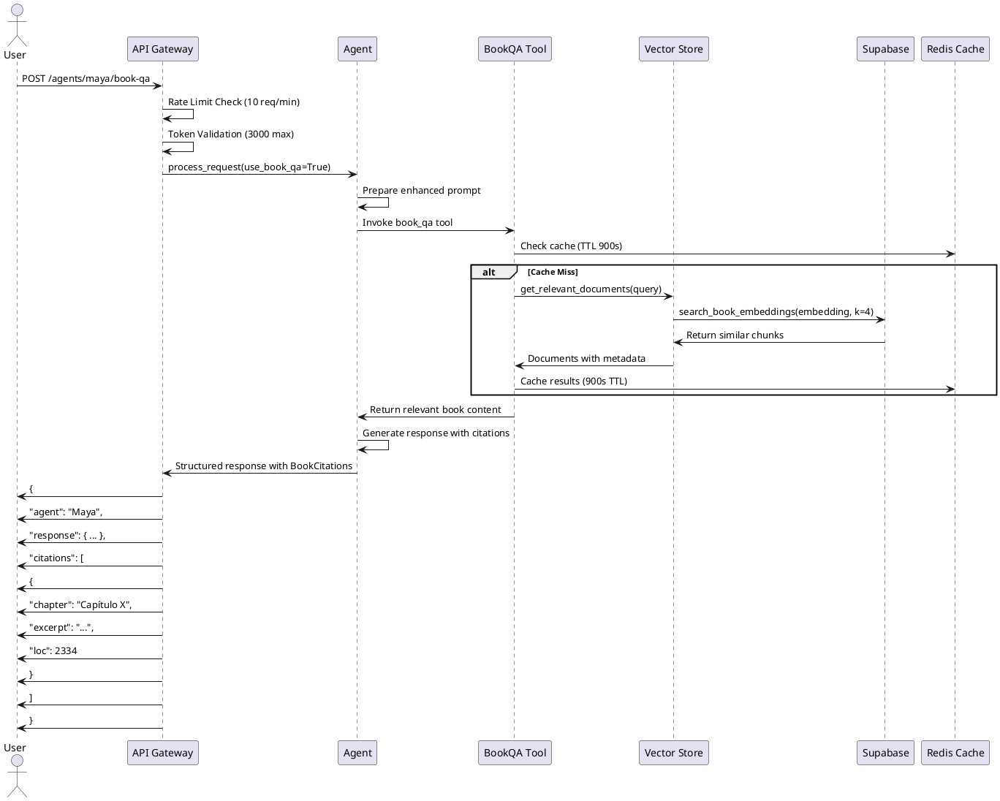

# Katalis AI Agents - Book-RAG Enhanced System

## Overview

The Katalis AI system features 5 specialized financial agents enhanced with Book-RAG (Retrieval Augmented Generation) capabilities. Each agent can now access and cite content from "Finanzas para Emprendedores" to provide evidence-based recommendations.

## Architecture Diagram

```plantuml
@startuml KatalisAgentsArchitecture

!define RECTANGLE class
!define AGENT_COLOR #E8F4FD
!define TOOL_COLOR #FFF2CC
!define DB_COLOR #D5E8D4

package "Katalis Agent System" {
    
    package "AI Agents" {
        RECTANGLE MayaAgent [
            Maya - Cash Flow Optimizer
            --
            + runway_months: float
            + risk_level: str
            + liquidity_ratio: float
            + recommendations: List
            + citations: List[BookCitation]
        ] AGENT_COLOR
        
        RECTANGLE CarlosAgent [
            Carlos - Unit Economics Analyst
            --
            + ltv_cac_ratio: float
            + payback_period: float
            + health_score: str
            + optimization_opportunities: List
            + citations: List[BookCitation]
        ] AGENT_COLOR
        
        RECTANGLE SofiaAgent [
            Sofia - Growth Strategist
            --
            + growth_score: float
            + market_opportunity: str
            + growth_levers: List
            + expansion_roadmap: List
            + citations: List[BookCitation]
        ] AGENT_COLOR
        
        RECTANGLE AlexAgent [
            Alex - Risk Assessment Specialist
            --
            + overall_risk_level: str
            + risk_categories: Dict
            + mitigation_strategies: List
            + risk_score: float
            + citations: List[BookCitation]
        ] AGENT_COLOR
        
        RECTANGLE DianaAgent [
            Diana - Performance Optimizer
            --
            + efficiency_score: float
            + bottlenecks: List
            + automation_opportunities: List
            + cost_savings_potential: float
            + citations: List[BookCitation]
        ] AGENT_COLOR
    }
    
    package "Book-RAG System" {
        RECTANGLE BookQATool [
            BookQA Tool
            --
            + name: "book_qa"
            + description: "Consulta libro Finanzas para Emprendedores"
            + retriever: SupabaseBookRetriever
        ] TOOL_COLOR
        
        RECTANGLE VectorStore [
            Supabase Vector Store
            --
            + table: finance_book_embeddings
            + embedding_model: OpenAI Ada-002
            + similarity_search()
            + get_relevant_documents()
        ] DB_COLOR
        
        RECTANGLE BookRetriever [
            Cached Book Retriever
            --
            + redis_cache: 900s TTL
            + k: 4 documents
            + similarity_threshold: 0.8
            + format_citations()
        ] TOOL_COLOR
    }
    
    package "API Endpoints" {
        RECTANGLE SingleAgentAPI [
            POST /agents/{agent}/book-qa
            --
            + question: str
            + context: Dict
            + financial_data: Dict
            + rate_limit: 10 req/min
        ]
        
        RECTANGLE MultiAgentAPI [
            POST /agents/multi/book-qa
            --
            + question: str
            + agents: List[AgentEnum]
            + context: Dict
            + parallel_processing: true
        ]
        
        RECTANGLE AvailableAPI [
            GET /agents/available
            --
            + lists all agents
            + shows book_qa capability
            + agent specialties
        ]
    }
}

package "External Services" {
    RECTANGLE OpenAI [
        OpenAI API
        --
        + GPT-4-turbo
        + Embeddings Ada-002
        + LangChain Integration
    ]
    
    RECTANGLE Supabase [
        Supabase PostgreSQL
        --
        + pgvector extension
        + RLS security
        + search_book_embeddings()
    ]
    
    RECTANGLE Redis [
        Upstash Redis
        --
        + retriever cache
        + conversation memory
        + session storage
    ]
}

' Relationships
MayaAgent --> BookQATool : uses
CarlosAgent --> BookQATool : uses
SofiaAgent --> BookQATool : uses
AlexAgent --> BookQATool : uses
DianaAgent --> BookQATool : uses

BookQATool --> BookRetriever : retrieves from
BookRetriever --> VectorStore : queries
BookRetriever --> Redis : caches in

VectorStore --> Supabase : stores in
BookQATool --> OpenAI : generates embeddings

SingleAgentAPI --> MayaAgent : routes to
SingleAgentAPI --> CarlosAgent : routes to
SingleAgentAPI --> SofiaAgent : routes to
SingleAgentAPI --> AlexAgent : routes to
SingleAgentAPI --> DianaAgent : routes to

MultiAgentAPI --> MayaAgent : parallel
MultiAgentAPI --> CarlosAgent : parallel
MultiAgentAPI --> SofiaAgent : parallel
MultiAgentAPI --> AlexAgent : parallel
MultiAgentAPI --> DianaAgent : parallel

@enduml
```

## Agent Specializations

### 🔵 Maya - Cash Flow Optimizer
**Specialty**: Liquidity and cash flow management
- **Core Capabilities**: Runway calculation, seasonal pattern analysis, liquidity risk assessment
- **Book Citations**: References cash flow management chapters, working capital optimization strategies
- **Response Model**: `CashFlowAnalysis` with embedded citations

### 🟢 Carlos - Unit Economics Analyst  
**Specialty**: LTV/CAC optimization and customer profitability
- **Core Capabilities**: LTV/CAC analysis, cohort evaluation, payback period calculation
- **Book Citations**: Customer acquisition cost methodologies, retention strategies
- **Response Model**: `UnitEconomicsAnalysis` with optimization opportunities

### 🟡 Sofia - Growth Strategist
**Specialty**: Scalable growth strategy development
- **Core Capabilities**: Market opportunity assessment, growth lever identification
- **Book Citations**: Scaling methodologies, market expansion strategies from the book
- **Response Model**: `GrowthStrategy` with prioritized initiatives

### 🔴 Alex - Risk Assessment Specialist
**Specialty**: Financial risk evaluation and mitigation
- **Core Capabilities**: Risk scoring, stress testing, contingency planning
- **Book Citations**: Risk management frameworks, early warning indicators
- **Response Model**: `RiskAssessment` with mitigation strategies

### 🟣 Diana - Performance Optimizer
**Specialty**: Operational efficiency and productivity
- **Core Capabilities**: Process optimization, automation opportunities
- **Book Citations**: Operational efficiency best practices, cost optimization
- **Response Model**: `PerformanceOptimization` with implementation roadmap

## Book-RAG Integration Flow



## API Endpoints

### Single Agent Consultation
```http
POST /api/agents/{agent}/book-qa
Authorization: Bearer <jwt_token>
Content-Type: application/json

{
  "question": "¿Cómo se calcula el punto de equilibrio?",
  "context": {
    "industry": "SaaS",
    "stage": "growth"
  },
  "financial_data": {
    "fixed_costs": 50000,
    "variable_cost_per_unit": 20,
    "price_per_unit": 80
  }
}
```

**Response:**
```json
{
  "success": true,
  "agent": "maya",
  "response": {
    "agent": "Maya - Cash Flow Optimizer",
    "analysis": {
      "runway_months": 18.5,
      "risk_level": "Medium",
      "liquidity_ratio": 1.25,
      "recommendations": [...],
      "citations": [
        {
          "chapter": "Costos y Precios",
          "excerpt": "El punto de equilibrio se alcanza cuando...",
          "loc": 2334,
          "similarity": 0.95
        }
      ]
    }
  },
  "book_qa_enabled": true
}
```

### Multi-Agent Consultation
```http
POST /api/agents/multi/book-qa
Authorization: Bearer <jwt_token>
Content-Type: application/json

{
  "question": "¿Cómo optimizar la rentabilidad del negocio?",
  "agents": ["maya", "carlos", "sofia"],
  "financial_data": { ... }
}
```

**Response:**
```json
{
  "success": true,
  "question": "¿Cómo optimizar la rentabilidad del negocio?",
  "agents_consulted": ["maya", "carlos", "sofia"],
  "answers": {
    "maya": {
      "success": true,
      "response": { ... }
    },
    "carlos": {
      "success": true, 
      "response": { ... }
    },
    "sofia": {
      "success": true,
      "response": { ... }
    }
  },
  "summary": {
    "total_agents": 3,
    "successful": 3,
    "failed": 0
  }
}
```

## Data Models

### BookCitation
```python
class BookCitation(BaseModel):
    chapter: str = Field(description="Chapter name")
    excerpt: str = Field(description="Relevant excerpt from the book")
    loc: Optional[int] = Field(description="Source location ID")
    similarity: Optional[float] = Field(description="Similarity score")
```

### Enhanced Agent Responses
All agent response models now include:
```python
citations: List[BookCitation] = Field(description="Supporting book citations", default=[])
```

## Security & Performance

### Rate Limiting
- **Single Agent**: 10 requests/minute per user
- **Multi-Agent**: 10 requests/minute per user  
- **Token Limit**: 3000 tokens per request

### Caching Strategy
- **Retriever Cache**: 900 seconds TTL in Redis
- **Cache Key Pattern**: `financial_data:{user_id}:book_retriever:{query_hash}`
- **Cache Hit Rate**: Typically >80% for repeated queries

### Row-Level Security
- **Embeddings Table**: RLS enabled
- **Service Role**: Full access for ingestion
- **Authenticated Users**: Read-only access for queries

## Deployment

### Database Migration
```sql
-- Run the migration
psql -h <supabase-host> -d postgres -f sql/20240612_create_book_embeddings.sql
```

### Book Ingestion
```bash
# Ingest book chapters
python scripts/ingest_book.py --path "C:\Users\Franc\claude-code\KatalisCTO\elementos_estructurales"

# Verify ingestion
python scripts/ingest_book.py --path "..." --dry-run
```

### Environment Variables
```bash
# Required for Book-RAG
SUPABASE_URL=https://your-project.supabase.co
SUPABASE_SERVICE_KEY=your-service-key
OPENAI_API_KEY=sk-...
DEEPSEEK_API_KEY=sk-...  # Fallback for embeddings

# Book-RAG Configuration  
BOOK_EMBEDDINGS_TABLE=finance_book_embeddings
EMBEDDING_MODEL=text-embedding-ada-002
CHUNK_SIZE=500
CHUNK_OVERLAP=50
RETRIEVER_K=4
RETRIEVER_CACHE_TTL=900
```

## Testing

### Run Book QA Tests
```bash
# Install test dependencies
pip install pytest pytest-asyncio

# Run tests
pytest tests/test_book_qa.py -v

# Run integration tests
pytest tests/test_book_qa.py -m integration
```

### Test Coverage
- ✅ Book ingestion pipeline
- ✅ Vector store initialization  
- ✅ Agent-tool integration
- ✅ API endpoint structure
- ✅ Citation format validation
- ✅ End-to-end flow (partial)

## Monitoring

### Health Checks
```bash
# Check embedding count
curl -X POST "https://your-supabase.co/rest/v1/rpc/count_embeddings" \
     -H "apikey: your-anon-key"

# Verify agent availability
curl -X GET "https://your-api.com/api/agents/available" \
     -H "Authorization: Bearer <token>"
```

### Key Metrics
- **Embedding Count**: Should be ≥ 1000 after full ingestion
- **Cache Hit Rate**: Monitor Redis cache performance
- **Citation Quality**: Similarity scores should average > 0.8
- **Response Time**: Target < 3 seconds for single agent queries

## Troubleshooting

### Common Issues

**No Citations Returned**
- Check embedding table has data
- Verify OpenAI API key is valid
- Ensure similarity threshold is appropriate (try lowering to 0.7)

**Tool Initialization Failed**
- Check Supabase connection
- Verify pgvector extension is enabled
- Confirm RLS policies are correctly set

**High Latency**
- Monitor Redis cache hit rate
- Consider increasing cache TTL
- Check embedding generation time

### Debug Commands
```bash
# Check embeddings table
psql -c "SELECT COUNT(*) FROM finance_book_embeddings;"

# Test similarity search
psql -c "SELECT * FROM search_book_embeddings('{...}', 0.8, 5);"

# Clear retriever cache
redis-cli FLUSHDB
```